| 修正のある刷 | ページ | 行 | 修正前 | 修正後 |
|:-----------|:------------|:------------|:------------|:------------|
| 11 | 9 | 下から14行目 | (「仮説Hが正しいとした時に…」の前に補足) | 現実的には証明できないが、この小項目では設定したモデルが正しいと仮定する。この場合、 |
| 11 | 84 | 2行目 | 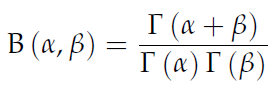 | 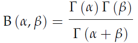 |
| 11 | 174 | 下から2行目 | 負の無限大を加わって | 負の無限大が加わって |
| 9 | 61 | 図5.2 | (データが異なりましたので差し替えます) | 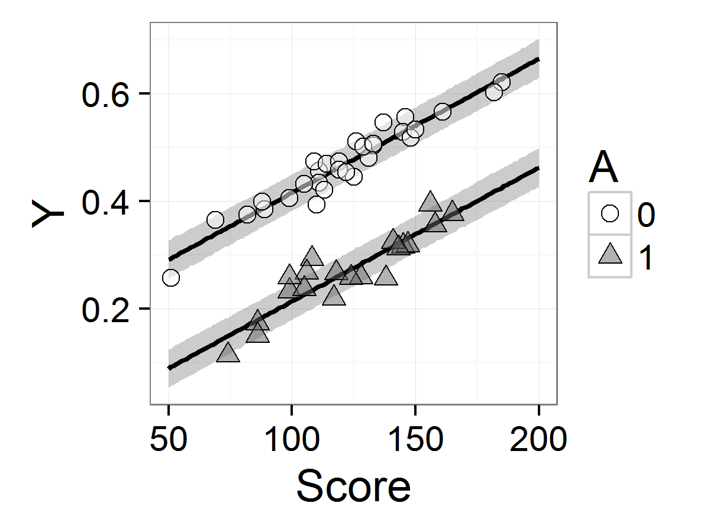 |
| 9 | 206 | (11.5)式 | 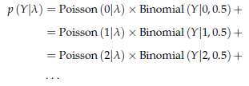 | 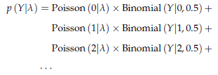 |
| 9 | 231 | 10行目 | 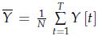 | 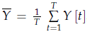 |
| 9 | 231 | 11行目 | 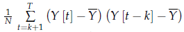 | 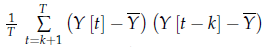 |
| 6 | 73 | コードを除いて6行目 | 図4.8（左）(p.38) に相当する． | 図4.8（左）(p.49) に相当する． |
| 4 | 21 | 10行目 | WinBUG | WinBUGS |
| 2 | 118 | コードの3行目 | `d <- read.csv(file='input/data-protein.txt')` | `d <- read.csv(file='input/data-protein.txt', stringsAsFactors=FALSE)` |
| 2 | 205 | 下から10行目 | はStanで用意されている便利な関数であり，(11.4)式のlog Bernoulli(Y&#124;q)と等価である． | (前の文と重複しているため削除) |
| 1 | 8 | 11行目 | 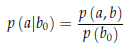 | 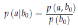 |
| 1 | 29 | 3行目 | ちなみにMacの場合には，Rとは別にApp StoreからXcodeとそのC++ toolsをインストールする必要がある． | Xcode自体はインストールする必要がありません． <blockquote class="twitter-tweet" data-lang="ja">
Macでコマンドライン開発ツールをインストールするには，ターミナルに xcode-select --install と打ち込むのが推奨だけれど，gcc と打ち込むだけでもインストールが始まるみたいだ。Xcodeはゴミ箱に捨ててもたいてい困らない
&mdash; Haruhiko Okumura (@h_okumura) <a href="https://twitter.com/h_okumura/status/790005951650631680">2016年10月23日</a></blockquote> |
| 1 | 45 | 下から7行目 | (「…1000～5000ぐらいで実行している.」に続けて補足) | 一般にMCMC を使った推定の場合，事後平均をもう1桁正確に推定するためには中心極限定理より100倍のMCMCサンプルが必要となる. 必要に応じてiterを増やそう. |
| 1 | 61 | 脚注1 | http://www2.kobe-u.ac.jp/~yyanai/jp/quant-methods-stata/R/ch12withR.html | http://yukiyanai.github.io/jp/quant-methods-stata/R/ch12withR.html |
| 1 | 167 | コードを除いて7行目 および脚注1行目 | Box-Mueller変換 | Box-Muller変換 |
| 1 | 197 | 1行目 | (「この節では，…」の前に補足) | 5.1.6項で説明したデータのスケーリングも再パラメータ化の一種と言えるだろう． |
| 1 | 213 | データファイル11.5のキャプション | data-mix3.txt | data-ZIP.txt |
| 1 | 218 | コードを除いて5行目 | qとmuの順位相関係数 | qとlambdaの順位相関係数 |
| 1 | 238 | 2行目 | (「…必要はない.」に続けて補足) | ヤコビアンの調整について詳しく知りたい読者は，Stanのマニュアルの「Reparameterization & Change of Variables」の章を読むとよい． |
| 1 | 261 | 【B】の下から3つめ | Box-Mueller変換 | Box-Muller変換 |
